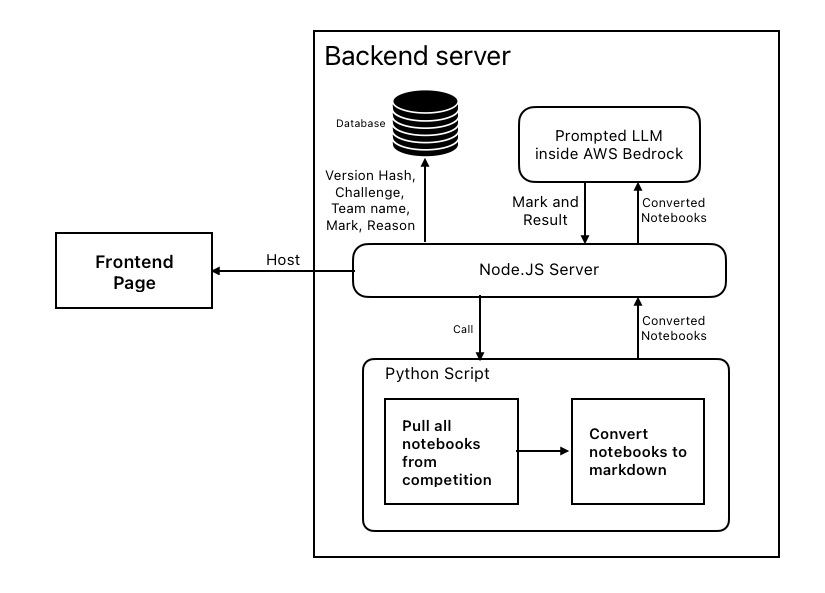
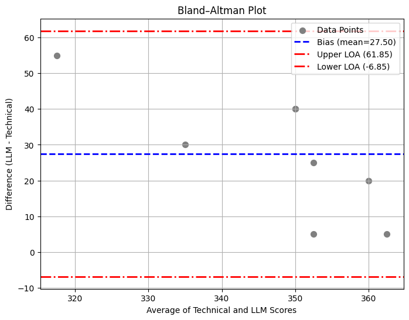

# Automated Leaderboard System for Hackathon Evaluation Using Large Language Models 

The code for the paper [Automated Leaderboard System for Hackathon Evaluation Using Large Language Models ]()

# Architecture

<figure>
  
  <figcaption>Overview of the system architecture illustrating the processing pipeline of the Jupyter notebook submissions, from initial raw data intake to the final predicted results.</figcaption>
</figure>


# Results

<figure>
  
  <figcaption>Bland-Altman analysis [22] table reveals a mean difference (bias) of 27.5 points—meaning the LLM scores are, on average, 27.5 points higher than the technical scores and representing roughly 6.9% of the maximum technical score. The 95% limits of agreement (–6.83 to 61.83) indicate that most differences fall within a 68.66-point range, which aligns with typical inter-rater variability in manual grading and supports the reliability of our hybrid evaluation approach.</figcaption>
</figure>

# Deployment

## How to download the Submissions manually

Preparing [Kaggle API credentials](https://github.com/Kaggle/kaggle-api/blob/main/docs/README.md).

```bash
pip install kaggle
```

Run the file `retrieve-competition.py` it will download and convert all the submission files to .md file.


## How to launch the server

You should have node on your machine. And you are welcome to create a SQLite db file `results.db`

```
npm install
```

```
node index.js
```

## How to run the marking manually

```
node mark.js
```

# Citation

```bibtex

```